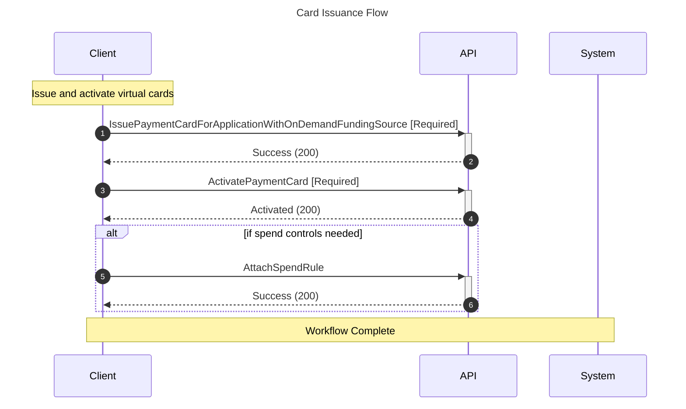

# Workflow Sequence Diagram Generation

Automatically generates Mermaid sequence diagrams for all workflows defined in program YAML files.

## Features

- **Automatic Diagram Generation**: Creates sequence diagrams from workflow definitions
- **Mermaid Format**: Uses Mermaid.js for beautiful, interactive diagrams
- **Multiple Outputs**: Generates individual diagrams and combined views
- **HTML Integration**: Diagrams render automatically in HTML exports
- **Markdown Support**: Diagrams embedded directly in Markdown files

## Generated Outputs

### File Structure
```
data/sequences/
└── {program_type}/
    ├── initial_setup.md         # Individual workflow diagram
    ├── onboarding.md           # Individual workflow diagram  
    ├── card_issuance.md        # Individual workflow diagram
    ├── transaction_processing.md # Individual workflow diagram
    └── all_workflows.md        # Combined view of all workflows
```

### Diagram Components

Each sequence diagram includes:
- **Participants**: Client, API, System, Webhooks (as needed)
- **Numbered Steps**: Auto-numbered sequence of operations
- **Required Markers**: [Required] tags for mandatory operations
- **Conditional Flows**: Alt blocks for conditional steps
- **Descriptions**: Notes explaining workflow purpose
- **Response Types**: HTTP status codes and response types

## Usage

### Standalone Generation

```bash
# Generate diagrams for a specific program
python src/workflow_diagram_generator.py --program ap_automation

# Generate diagrams for all programs
python src/workflow_diagram_generator.py --all

# Generate with HTML output
python src/workflow_diagram_generator.py --program ap_automation --html
```

### Integrated with Solution Generator

When you generate a solution document, diagrams are automatically created and embedded:

```bash
# Generate with HTML output (includes rendered diagrams)
python src/modular_solution_generator.py --program ap_automation --customer trip_com
```

## Example Diagram



## Output Formats

### Markdown Files
- Contains raw Mermaid syntax in code blocks
- Can be viewed in any Markdown editor that supports Mermaid
- GitHub automatically renders Mermaid diagrams

### HTML Files
- Includes Mermaid.js library for rendering
- Interactive diagrams with zoom and pan
- Professional styling with GitHub-like theme
- Print-friendly layout

### Confluence
- Mermaid blocks can be added using Confluence plugins
- Or export as images for embedding

## Customization

### Modify Diagram Style

Edit the Mermaid initialization in `export_formatter.py`:

```javascript
mermaid.initialize({
    startOnLoad: true,
    theme: 'default',
    themeVariables: {
        primaryColor: '#fff',
        primaryTextColor: '#000',
        primaryBorderColor: '#2c3e50',
        lineColor: '#2c3e50'
    }
});
```

### Customize Participants

Edit `workflow_diagram_generator.py` to add custom participants:

```python
def _identify_participants(self, workflow_data):
    participants = ["Client", "API", "System"]
    # Add custom participants based on operations
    return participants
```

### Response Types

Customize response messages in `_determine_response_type()`:

```python
def _determine_response_type(self, operation):
    if 'create' in operation.lower():
        return "Created (201)"
    # Add custom response types
```

## Benefits

1. **Visual Documentation**: Complex workflows become easy to understand
2. **Automatic Updates**: Diagrams regenerate when workflows change
3. **Standardized Format**: Consistent diagram style across all programs
4. **No Manual Drawing**: Saves time on documentation
5. **Interactive Viewing**: HTML output allows zooming and exploration
6. **Version Control**: Text-based format works with Git

## Troubleshooting

### Diagrams Not Rendering in HTML
- Ensure internet connection (Mermaid.js loads from CDN)
- Check browser console for JavaScript errors
- Verify Mermaid syntax is correct

### Missing Workflows
- Ensure workflows are defined in program YAML
- Check that workflow has a 'steps' array
- Verify YAML syntax is correct

### Styling Issues
- Clear browser cache
- Check for CSS conflicts
- Verify Mermaid version compatibility

## Integration Points

The sequence diagram generator integrates with:
- **Modular Solution Generator**: Embeds diagrams in documents
- **Export Formatter**: Renders diagrams in HTML output
- **YAML Generator**: Works with generated program configs
- **API Documentation**: Can be used standalone for API docs