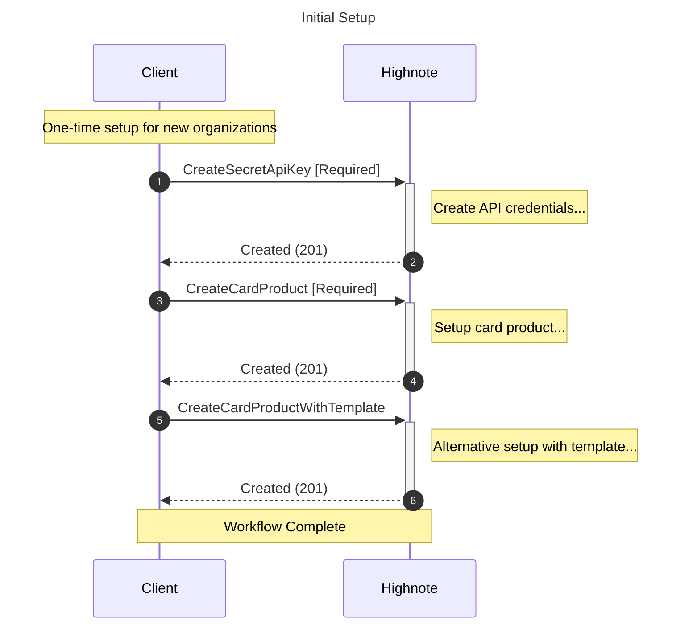
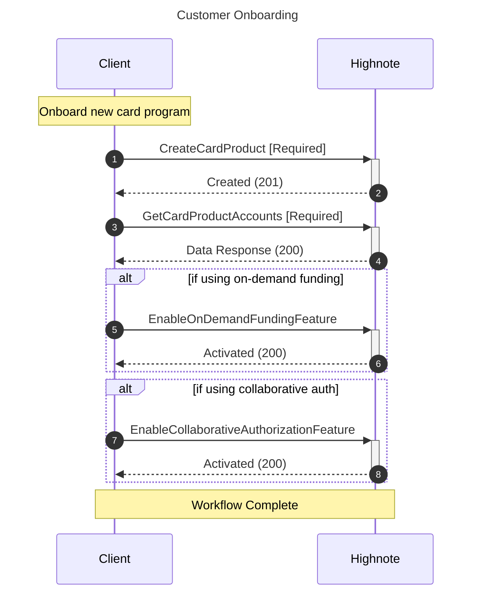
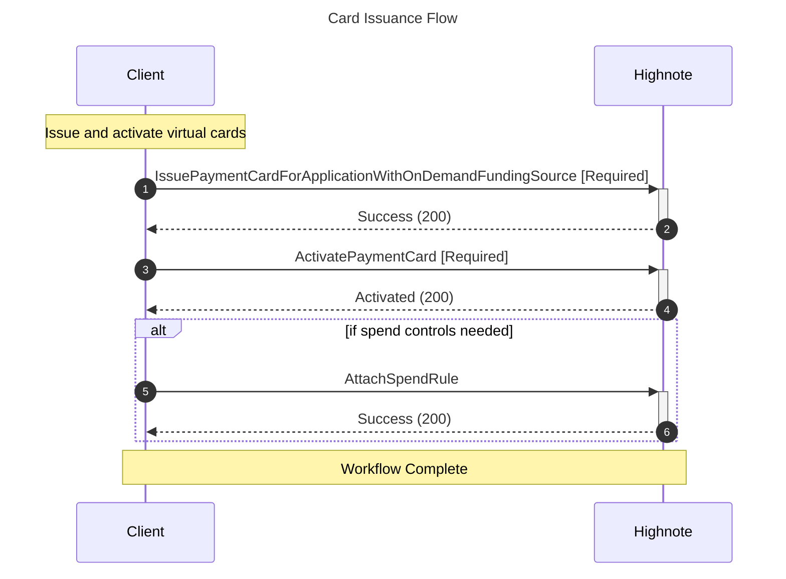
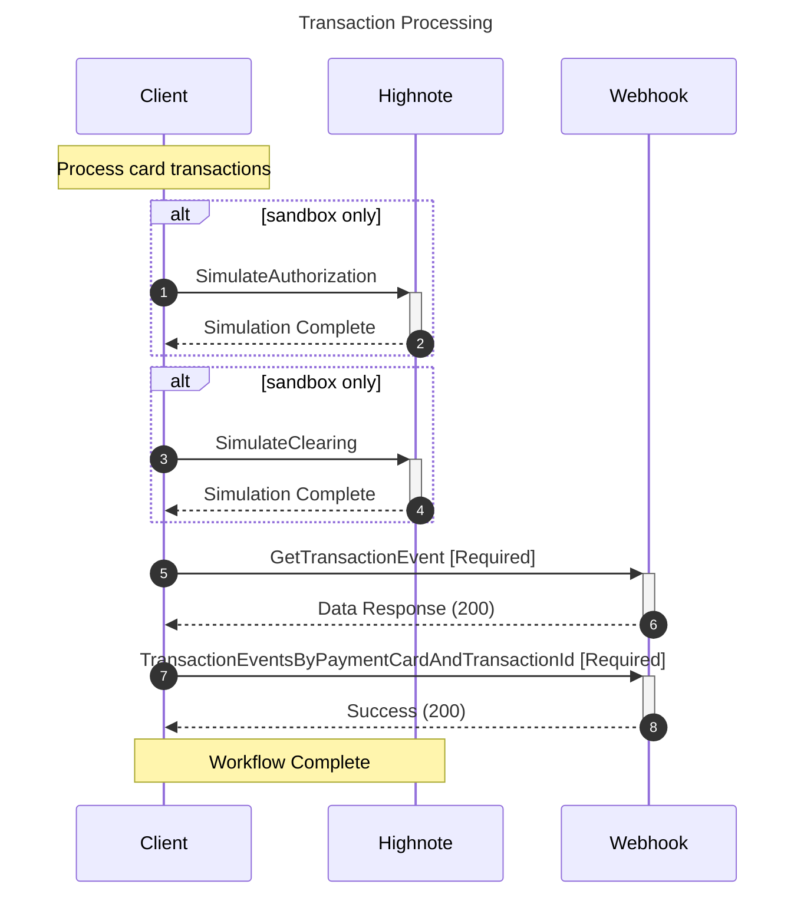
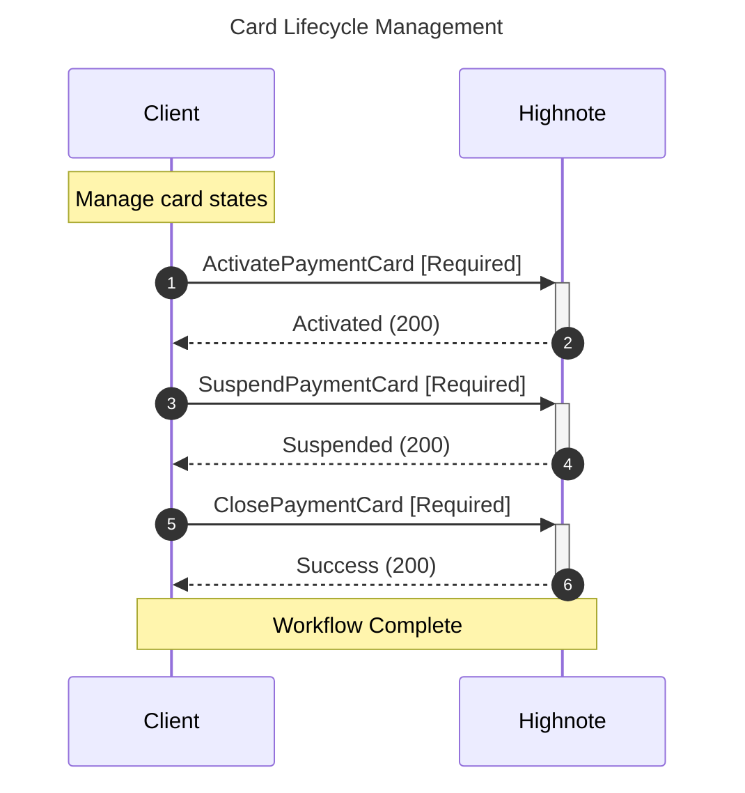

# All Workflows for ap_automation

Generated: 2025-08-08 08:54:41

## Initial Setup

---

## Customer Onboarding

---

## Card Issuance Flow

---

## Transaction Processing

---

## Card Lifecycle Management

---

