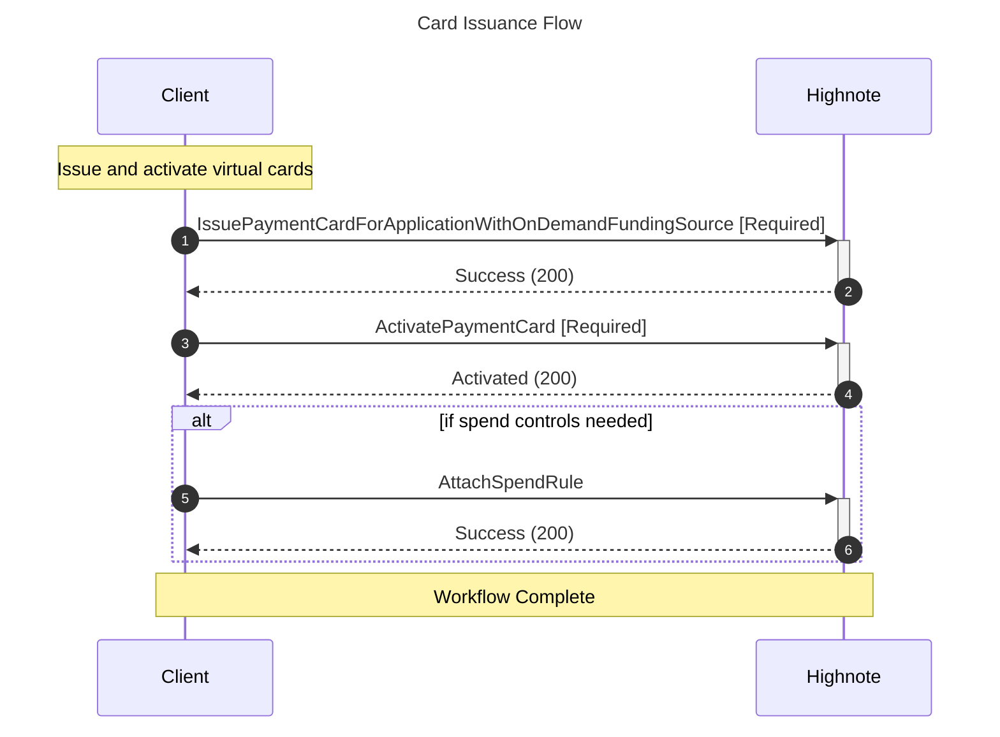

# Card Issuance Flow Workflow

Program: ap_automation

```mermaid
sequenceDiagram
    autonumber
    title Card Issuance Flow
    participant Client
    participant Highnote

    Note over Client: Issue and activate virtual cards

    Client->>+Highnote: IssuePaymentCardForApplicationWithOnDemandFundingSource [Required]
    Highnote-->>-Client: Success (200)

    Client->>+Highnote: ActivatePaymentCard [Required]
    Highnote-->>-Client: Activated (200)

    alt if spend controls needed
        Client->>+Highnote: AttachSpendRule
        Highnote-->>-Client: Success (200)
    end

    Note over Client,Highnote: Workflow Complete
```
