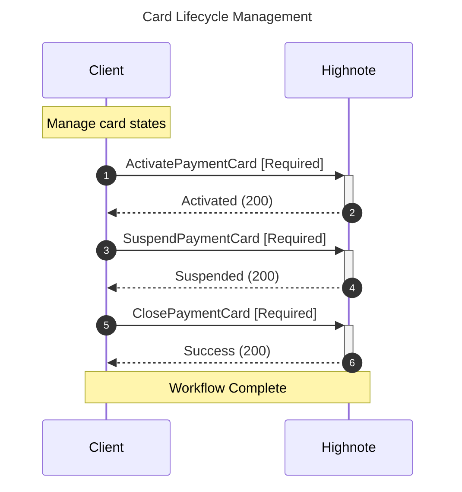

# Card Lifecycle Management Workflow

Program: ap_automation

```mermaid
sequenceDiagram
    autonumber
    title Card Lifecycle Management
    participant Client
    participant Highnote

    Note over Client: Manage card states

    Client->>+Highnote: ActivatePaymentCard [Required]
    Highnote-->>-Client: Activated (200)

    Client->>+Highnote: SuspendPaymentCard [Required]
    Highnote-->>-Client: Suspended (200)

    Client->>+Highnote: ClosePaymentCard [Required]
    Highnote-->>-Client: Success (200)

    Note over Client,Highnote: Workflow Complete
```
