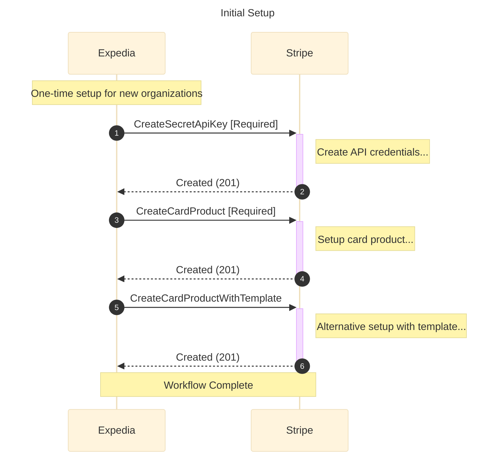
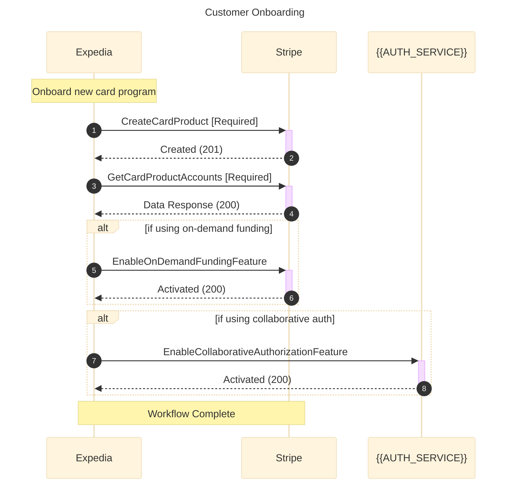
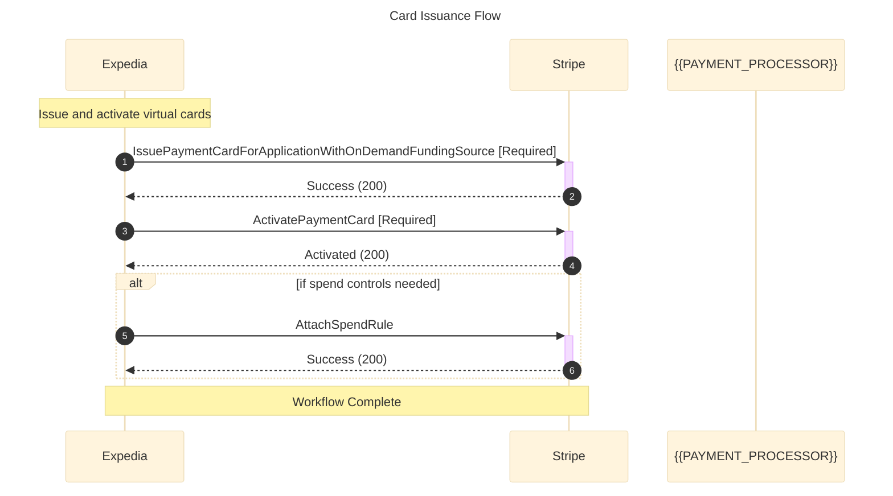
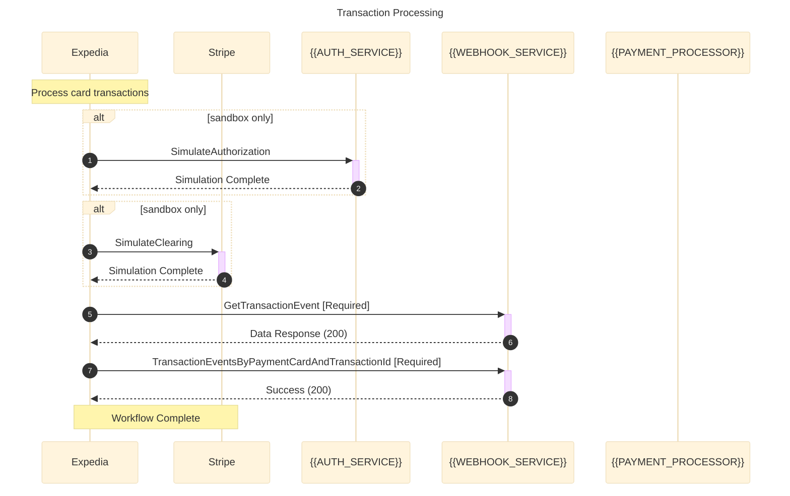
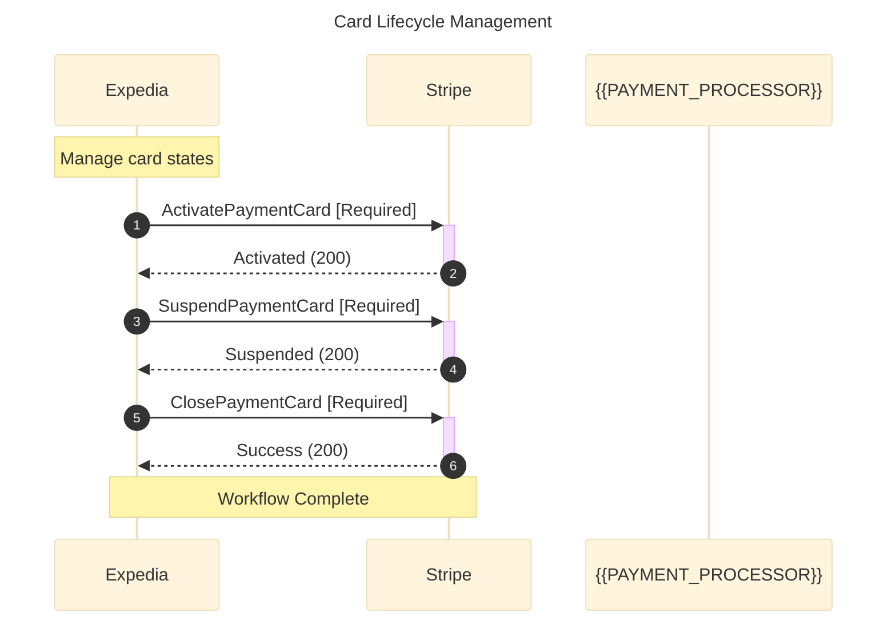

# All Workflow Templates for ap_automation

Generated: 2025-08-08 08:58:27

## How to Use These Templates

1. Replace placeholder values in participant declarations
2. Customize operation names and descriptions as needed
3. Add or remove steps based on your specific implementation

## Template Variables

- `CUSTOMER`: Customer/Subscriber alias
- `VENDOR`: Primary vendor/service provider alias
- `WEBHOOK`: Webhook service alias (if used)
- `EXTERNAL`: External service alias (if used)

---

## Initial Setup

---

## Customer Onboarding

---

## Card Issuance Flow

---

## Transaction Processing

---

## Card Lifecycle Management

---

