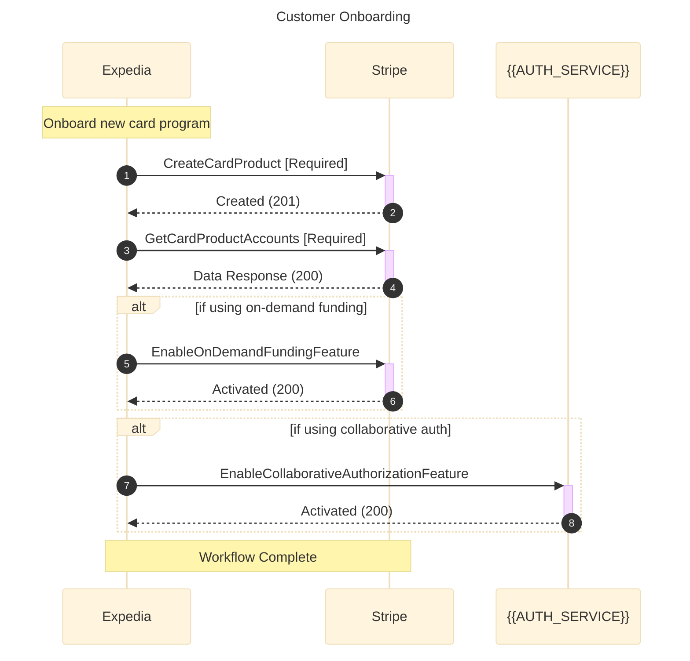

# Customer Onboarding Workflow Template

Program: ap_automation

## Template Variables

Replace the following placeholders with actual values:

- `Expedia`: Your customer/subscriber name (e.g., TripLink.com)
- `Stripe`: The vendor name (e.g., Highnote)
- `{{WEBHOOK_SERVICE}}`: Webhook service name if applicable
- `{{EXTERNAL_SERVICE}}`: External service name if applicable
- `{{AUTH_SERVICE}}`: Authentication service name if applicable
- `{{PAYMENT_PROCESSOR}}`: Payment processor name if applicable

## Diagram

