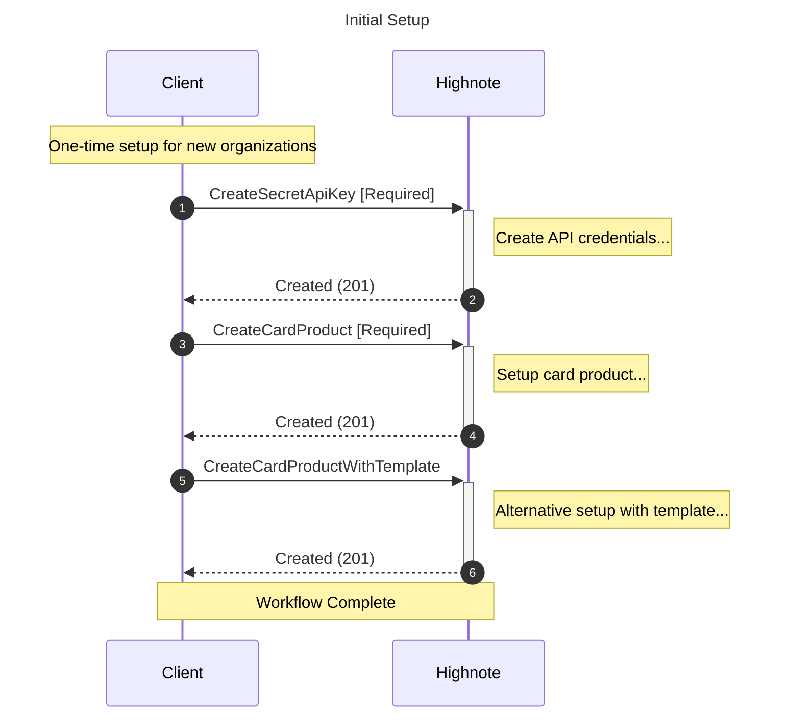

# Initial Setup Workflow

Program: ap_automation

```mermaid
sequenceDiagram
    autonumber
    title Initial Setup
    participant Client
    participant Highnote

    Note over Client: One-time setup for new organizations

    Client->>+Highnote: CreateSecretApiKey [Required]
    Note right of Highnote: Create API credentials...
    Highnote-->>-Client: Created (201)

    Client->>+Highnote: CreateCardProduct [Required]
    Note right of Highnote: Setup card product...
    Highnote-->>-Client: Created (201)

    Client->>+Highnote: CreateCardProductWithTemplate
    Note right of Highnote: Alternative setup with template...
    Highnote-->>-Client: Created (201)

    Note over Client,Highnote: Workflow Complete
```
