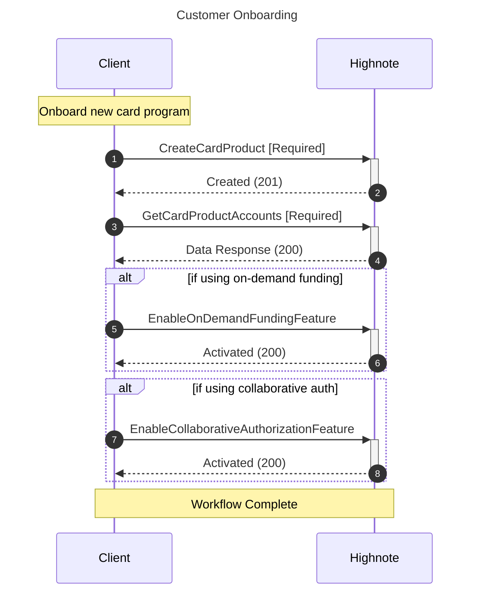

# Customer Onboarding Workflow

Program: ap_automation

```mermaid
sequenceDiagram
    autonumber
    title Customer Onboarding
    participant Client
    participant Highnote

    Note over Client: Onboard new card program

    Client->>+Highnote: CreateCardProduct [Required]
    Highnote-->>-Client: Created (201)

    Client->>+Highnote: GetCardProductAccounts [Required]
    Highnote-->>-Client: Data Response (200)

    alt if using on-demand funding
        Client->>+Highnote: EnableOnDemandFundingFeature
        Highnote-->>-Client: Activated (200)
    end

    alt if using collaborative auth
        Client->>+Highnote: EnableCollaborativeAuthorizationFeature
        Highnote-->>-Client: Activated (200)
    end

    Note over Client,Highnote: Workflow Complete
```
