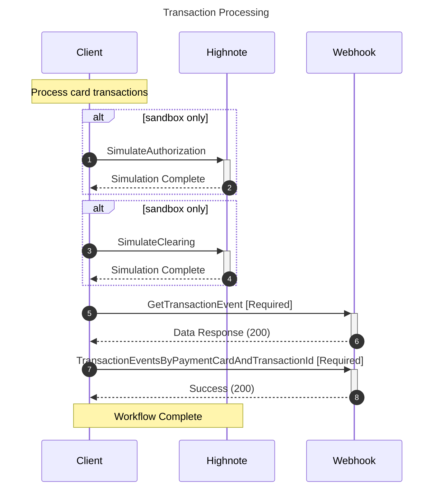

# Transaction Processing Workflow

Program: ap_automation

```mermaid
sequenceDiagram
    autonumber
    title Transaction Processing
    participant Client
    participant Highnote
    participant Webhook

    Note over Client: Process card transactions

    alt sandbox only
        Client->>+Highnote: SimulateAuthorization
        Highnote-->>-Client: Simulation Complete
    end

    alt sandbox only
        Client->>+Highnote: SimulateClearing
        Highnote-->>-Client: Simulation Complete
    end

    Client->>+Webhook: GetTransactionEvent [Required]
    Webhook-->>-Client: Data Response (200)

    Client->>+Webhook: TransactionEventsByPaymentCardAndTransactionId [Required]
    Webhook-->>-Client: Success (200)

    Note over Client,Highnote: Workflow Complete
```
