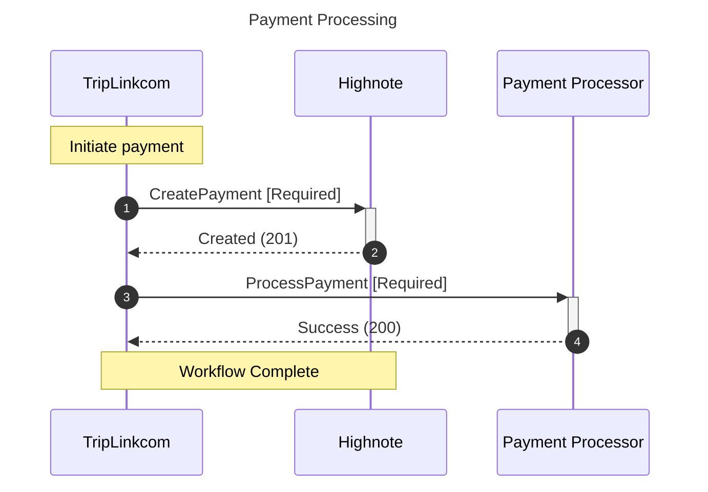

# Solution Generator

A modern Node.js/TypeScript application for generating API integration solution documents with Mermaid sequence diagrams.

## Features

- 📝 **Markdown Generation** - Clean, well-structured documentation
- 🎨 **Mermaid Diagrams** - Interactive sequence diagrams with participant aliases
- 🌐 **HTML Export** - Beautiful HTML with embedded Mermaid diagrams
- 📄 **PDF Export** - Professional PDF documents via Puppeteer
- 🔧 **Template System** - Handlebars templates for customization
- 🚀 **TypeScript** - Type-safe development
- 📦 **Modular Design** - Clean separation of concerns

## Installation

```bash
# Install dependencies
npm install

# Build TypeScript (optional)
npm run build
```

## Usage

### CLI Commands

```bash
# Generate a solution document
npx tsx src/cli.ts generate -p <program> -c <customer>

# Generate with HTML output
npx tsx src/cli.ts generate -p ap_automation -c "TripLink.com" -f html

# Generate with PDF output
npx tsx src/cli.ts generate -p ap_automation -c trip_com -f pdf

# List available programs
npx tsx src/cli.ts list-programs

# List available customer contexts
npx tsx src/cli.ts list-customers

# Generate a workflow template
npx tsx src/cli.ts template -w "Payment Flow"
```

### Examples

```bash
# Generate solution for TripLink.com using AP Automation program
npx tsx src/cli.ts generate -p ap_automation -c "TripLink.com"

# Generate HTML version
npx tsx src/cli.ts generate -p ap_automation -c trip_com -f html

# Generate PDF version
npx tsx src/cli.ts generate -p ap_automation -c trip_com -f pdf
```

## Project Structure

```
solution-generator/
├── src/
│   ├── cli.ts                 # CLI interface
│   ├── generators/
│   │   ├── SolutionGenerator.ts   # Main orchestrator
│   │   ├── DiagramGenerator.ts    # Mermaid diagram generation
│   │   └── TemplateEngine.ts      # Handlebars template engine
│   ├── exporters/
│   │   ├── HTMLExporter.ts        # HTML export with Mermaid
│   │   └── PDFExporter.ts         # PDF generation via Puppeteer
│   ├── templates/
│   │   └── solution.hbs           # Main solution template
│   └── types/
│       └── index.ts               # TypeScript type definitions
├── data/                      # Data directory (shared with Python)
│   ├── programs/              # Program YAML configurations
│   ├── contexts/              # Customer context files
│   └── generated/             # Output documents
├── package.json
├── tsconfig.json
└── README.md
```

## Mermaid Diagram Generation

The solution generator creates Mermaid sequence diagrams with:

- **Participant Aliases**: CUSTOMER, VENDOR, WEBHOOK, AUTH, PAYMENT
- **Automatic Sanitization**: Handles special characters in names
- **Dynamic Participants**: Detects required participants from operations
- **Conditional Flows**: Supports alt/opt blocks for conditional steps

### Example Diagram



## Template Customization

Templates use Handlebars with custom helpers:

- `{{eq}}`, `{{ne}}`, `{{lt}}`, `{{gt}}` - Comparison helpers
- `{{add}}`, `{{subtract}}` - Math helpers
- `{{formatDate}}` - Date formatting
- `{{capitalize}}` - String capitalization
- `{{json}}` - JSON stringification

### Custom Template Example

Create a custom template in `src/templates/custom.hbs`:

```handlebars
# {{customer.customer.name}} Integration

{{#if workflowsWithDiagrams}}
{{#each workflowsWithDiagrams}}
## {{name}}
{{{diagram}}}
{{/each}}
{{/if}}
```

## Data Files

### Program Configuration (YAML)

Located in `data/programs/`:

```yaml
program_type: ap_automation
api_type: graphql
vendor: Highnote Inc.
capabilities:
  - virtual_card_issuance
  - on_demand_funding
workflows:
  initial_setup:
    name: Initial Setup
    description: One-time setup
    steps:
      - operation: CreateApiKey
        required: true
```

### Customer Context (YAML)

Located in `data/contexts/`:

```yaml
customer:
  name: TripLink.com
  industry: Travel
vendor:
  name: Highnote
  type: Payment Platform
objectives:
  - Reduce costs
  - Modernize API
```

## Development

```bash
# Run in development mode with hot reload
npm run dev

# Build TypeScript
npm run build

# Run built version
npm start

# Run tests (when implemented)
npm test
```

## Troubleshooting

### Mermaid Syntax Errors

If you encounter Mermaid syntax errors:

1. Check for special characters in participant names
2. Ensure proper escaping of quotes in labels
3. Verify alt/opt block syntax
4. Test diagrams at [mermaid.live](https://mermaid.live)

### PDF Generation Issues

If PDF generation fails:

1. Ensure Puppeteer dependencies are installed
2. Check system requirements for headless Chrome
3. Verify write permissions for output directory

## Dependencies

- **commander** - CLI framework
- **handlebars** - Template engine
- **markdown-it** - Markdown parser
- **mermaid** - Diagram generation
- **puppeteer** - PDF generation
- **yaml** - YAML parsing
- **typescript** - Type safety
- **tsx** - TypeScript execution

## License

MIT

## Contributing

1. Fork the repository
2. Create a feature branch
3. Make your changes
4. Add tests if applicable
5. Submit a pull request

## Support

For issues or questions, please file an issue in the repository.