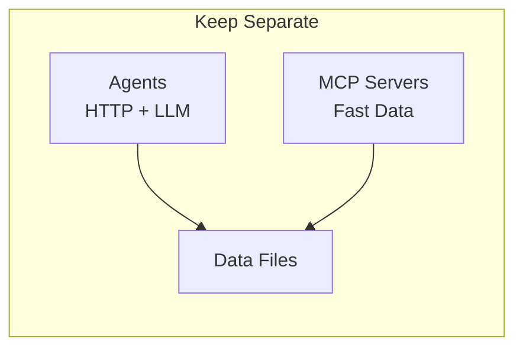
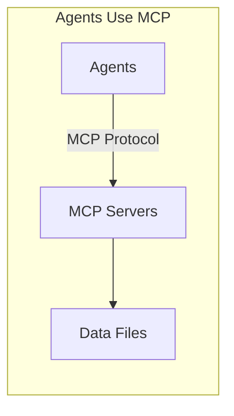
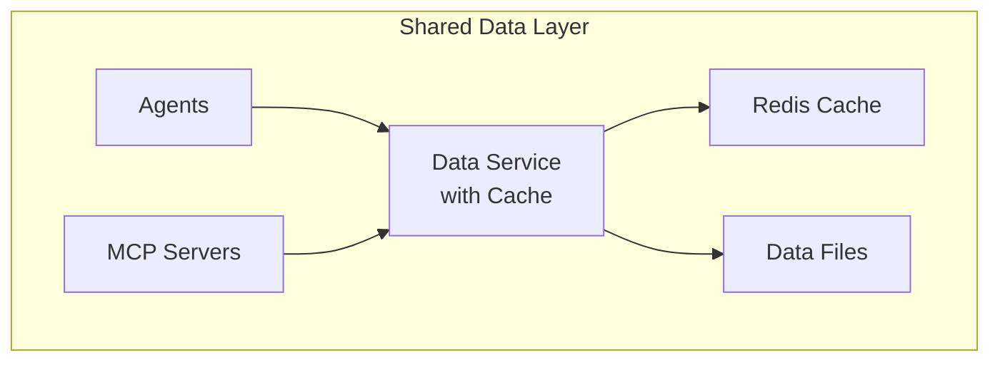

# Should Agents Use MCP Servers? Architecture Decision

## Current Architecture
```
Agents (HTTP) → Direct File Access → LLM Processing → Response
MCP Servers → Direct File Access → Structured Data → Response
```

## Option Analysis

### Option 1: Keep As-Is (RECOMMENDED ✅)

**Architecture:**


**Pros:**
- ✅ **Simple & Working** - Already functional, no refactoring needed
- ✅ **Optimized for Purpose** - Each optimized for its use case
- ✅ **No Protocol Overhead** - Agents use direct file access
- ✅ **Independent Scaling** - Can scale agents and MCP separately
- ✅ **Clear Separation** - MCP for AI assistants, Agents for applications

**Cons:**
- ❌ Duplicate data loading code
- ❌ Two systems to maintain

**Best For:** Current setup where agents serve applications and MCP serves AI assistants

### Option 2: Agents Call MCP Servers (NOT RECOMMENDED ❌)

**Architecture:**


**Pros:**
- ✅ Single data access layer
- ✅ Consistent data retrieval

**Cons:**
- ❌ **Protocol Mismatch** - MCP designed for AI assistants, not services
- ❌ **Performance Overhead** - JSON-RPC adds latency
- ❌ **Complex Implementation** - Need MCP client in each agent
- ❌ **Circular Dependency Risk** - If MCP ever needs agent data
- ❌ **Limited by MCP** - Can't optimize data access per agent

**Why This is Bad:**
```python
# Current (Fast & Direct)
def get_schema_data():
    return json.load(open('schema.json'))  # <1ms

# With MCP (Slow & Complex)
def get_schema_data():
    mcp_client = MCPClient()
    response = mcp_client.call_tool('get_schema', {})  # 10-50ms overhead
    return response['result']
```

### Option 3: Shared Data Service (BEST LONG-TERM 🌟)

**Architecture:**


**Pros:**
- ✅ **Best Performance** - Cached, optimized data access
- ✅ **Single Source of Truth** - One data layer
- ✅ **No Protocol Overhead** - Direct function calls
- ✅ **Proper Architecture** - Clean separation of concerns

**Cons:**
- ❌ Requires refactoring
- ❌ New component to build

**Implementation:**
```python
# shared/data_service.py
class DataService:
    _instance = None
    
    def __new__(cls):
        if not cls._instance:
            cls._instance = super().__new__(cls)
            cls._instance.cache = {}
            cls._instance.load_data()
        return cls._instance
    
    def get_schema(self, query=None):
        # Shared by both agents and MCP
        return self.cache.get('schema', {})

# In agents
data_service = DataService()
schema = data_service.get_schema()

# In MCP servers  
data_service = DataService()
schema = data_service.get_schema()
```

## Performance Comparison

| Approach | Data Access Time | Complexity | Maintenance |
|----------|-----------------|------------|-------------|
| Current (Separate) | <1ms | Low | Medium |
| Agents→MCP | 10-50ms | High | High |
| Shared Service | <1ms (cached) | Medium | Low |

## Decision Matrix

| Criteria | Keep As-Is | Agents→MCP | Shared Service |
|----------|------------|------------|----------------|
| Performance | ⭐⭐⭐ | ⭐ | ⭐⭐⭐⭐ |
| Simplicity | ⭐⭐⭐⭐ | ⭐ | ⭐⭐⭐ |
| Maintainability | ⭐⭐ | ⭐ | ⭐⭐⭐⭐ |
| Scalability | ⭐⭐⭐ | ⭐⭐ | ⭐⭐⭐⭐ |
| Time to Implement | ⭐⭐⭐⭐⭐ | ⭐ | ⭐⭐ |

## RECOMMENDATION: Keep As-Is

### Why Keep Current Architecture:

1. **It Works** - System is functional and meeting requirements
2. **No Performance Issues** - Both layers are fast enough
3. **Clear Purpose** - MCP for AI tools, Agents for applications
4. **Low Risk** - No changes means no bugs
5. **Time Efficient** - Focus on features, not refactoring

### When to Consider Changing:

Only consider architectural changes if you encounter:
- ❌ Performance problems with duplicate data loading
- ❌ Consistency issues between agents and MCP
- ❌ Memory problems from duplicate data
- ❌ Significant maintenance burden

### If You Must Change, Use Shared Service:

```python
# The RIGHT way (if needed)
class UnifiedDataLayer:
    """Used by both agents and MCP"""
    def __init__(self):
        self.schema = self._load_schema()
        self.docs = self._load_docs()
    
    def search(self, query):
        # Shared search logic
        return results

# NOT this way
class AgentWithMCP:
    """Agent calling MCP - DON'T DO THIS"""
    def get_data(self):
        # Adds complexity and latency
        return mcp_client.call_tool('get_data')
```

## Action Items

### Immediate (Do Now):
✅ Keep current architecture
✅ Document the separation clearly
✅ Monitor for actual problems

### Future (If Needed):
- 🔄 Consider shared data service IF performance issues arise
- 🔄 Add caching layer IF memory becomes a problem
- 🔄 Unify data access IF maintenance burden increases

## Summary

**Keep your current architecture** where:
- MCP servers provide fast data access for AI assistants (Claude, ChatGPT)
- Agents provide intelligent responses for applications
- Both access data independently

This is the right choice because:
1. **No real problem to solve** - Current setup works fine
2. **MCP protocol wrong tool** - Not designed for service communication
3. **Premature optimization** - Don't fix what isn't broken
4. **Risk vs Reward** - High risk, minimal benefit

**Bottom Line:** Your instinct to keep them separate is correct. MCP is for AI assistants, not for inter-service communication.