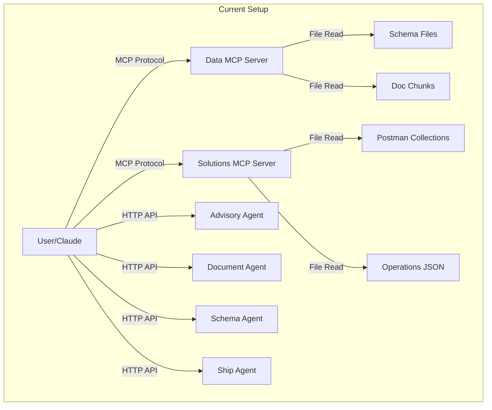
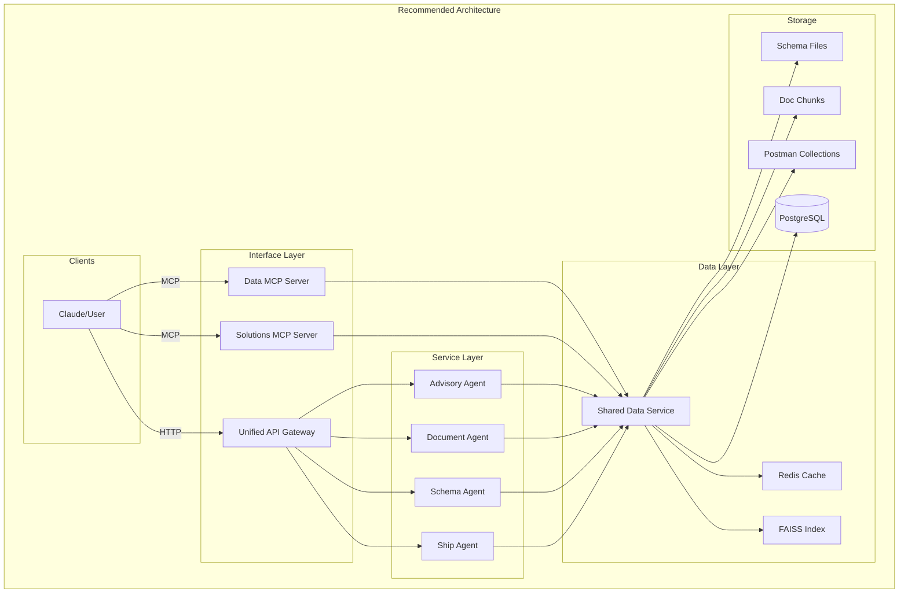

# Architecture Review: Agents vs MCP Interaction

## Current Architecture

### What We Have Now



**Problem**: Agents and MCP servers are completely separate - no interaction between them.

## Should Agents Interact with MCP?

### ❌ **Probably NOT** - Here's Why:

1. **Different Purposes**:
   - **MCP Servers**: Designed for AI assistants (Claude) to access tools/data
   - **Agents**: Standalone services with their own HTTP APIs
   - **MCP Protocol**: Specifically for AI-to-tool communication, not service-to-service

2. **Circular Dependency Risk**:
   - MCP servers currently call agents via subprocess
   - If agents call MCP, we create circular dependencies
   - Could lead to infinite loops or deadlocks

3. **Protocol Mismatch**:
   - MCP uses stdio/JSON-RPC protocol
   - Agents use HTTP REST/GraphQL
   - Adding MCP client to agents adds unnecessary complexity

4. **Performance Overhead**:
   - MCP adds protocol overhead
   - Direct function calls or HTTP APIs are more efficient
   - Agents need fast, direct data access

## Better Architecture Options

### Option 1: Shared Data Layer (Recommended)



**Benefits**:
- Single source of truth for data
- No circular dependencies
- Agents and MCP servers share data layer
- Better caching and performance
- Clear separation of concerns

### Option 2: Agent-to-Agent Communication

```python
# agents/shared/agent_client.py
class AgentClient:
    """Shared client for agent-to-agent communication"""
    
    def __init__(self):
        self.agents = {
            'schema': 'http://localhost:8000',
            'document': 'http://localhost:8001',
            'advisory': 'http://localhost:8002',
            'ship': 'http://localhost:8003'
        }
    
    async def query_schema(self, question: str):
        """Query schema agent directly"""
        async with aiohttp.ClientSession() as session:
            async with session.post(
                f"{self.agents['schema']}/query",
                json={"question": question}
            ) as response:
                return await response.json()
    
    async def search_docs(self, query: str):
        """Search documentation via document agent"""
        async with aiohttp.ClientSession() as session:
            async with session.post(
                f"{self.agents['document']}/search",
                json={"query": query}
            ) as response:
                return await response.json()
```

### Option 3: Unified Service Layer

```python
# services/unified_service.py
class UnifiedDataService:
    """Unified service that both agents and MCP can use"""
    
    def __init__(self):
        # Load all data once
        self.schema_index = self._load_schema_index()
        self.doc_index = self._load_doc_index()
        self.postman_data = self._load_postman()
        self.faiss_index = self._load_faiss()
    
    def search_schema(self, query: str, limit: int = 10):
        """Search schema - used by both agents and MCP"""
        # Shared implementation
        return self._search_faiss(query, 'schema', limit)
    
    def get_operations(self, program: str):
        """Get operations - used by both agents and MCP"""
        return self.postman_data.get(program, {})
```

Then both agents and MCP servers use this service:

```python
# In MCP server
class DataMCPServer:
    def __init__(self):
        self.data_service = UnifiedDataService()
    
    def search(self, query):
        return self.data_service.search_schema(query)

# In Schema Agent
class SchemaAgent:
    def __init__(self):
        self.data_service = UnifiedDataService()
    
    def answer_question(self, question):
        context = self.data_service.search_schema(question)
        return self.llm.generate(context, question)
```

## If You Really Want MCP-Agent Interaction

If you absolutely need agents to use MCP servers, here's how:

### 1. MCP Client Library

```python
# mcp/client.py
import asyncio
import json
from typing import Any, Dict

class MCPClient:
    """Client for calling MCP servers from Python code"""
    
    async def call_tool(self, server: str, tool: str, arguments: Dict[str, Any]):
        """Call an MCP tool programmatically"""
        
        # Create subprocess to MCP server
        proc = await asyncio.create_subprocess_exec(
            'python', '-m', f'src.{server}',
            stdin=asyncio.subprocess.PIPE,
            stdout=asyncio.subprocess.PIPE,
            stderr=asyncio.subprocess.PIPE
        )
        
        # Send JSON-RPC request
        request = {
            "jsonrpc": "2.0",
            "method": "tools/call",
            "params": {
                "name": tool,
                "arguments": arguments
            },
            "id": 1
        }
        
        # Write request
        proc.stdin.write(json.dumps(request).encode())
        await proc.stdin.drain()
        
        # Read response
        response = await proc.stdout.read()
        return json.loads(response)

# Usage in agent
class EnhancedSchemaAgent:
    def __init__(self):
        self.mcp_client = MCPClient()
    
    async def get_program_info(self, program: str):
        # Call MCP server instead of direct file access
        result = await self.mcp_client.call_tool(
            'solutions_mcp_server_v2',
            'get_program_info',
            {'program_type': program}
        )
        return result
```

### 2. HTTP Wrapper for MCP

```python
# mcp/http_wrapper.py
from fastapi import FastAPI
from mcp.src.solutions_mcp_server_v2 import SolutionsMCPServerV2

app = FastAPI()
mcp_server = SolutionsMCPServerV2()

@app.post("/mcp/{tool_name}")
async def call_mcp_tool(tool_name: str, arguments: dict):
    """HTTP endpoint to call MCP tools"""
    
    # Map HTTP request to MCP tool call
    if tool_name == "get_program_info":
        result = mcp_server._get_program_info(arguments["program_type"])
    elif tool_name == "find_operations":
        result = mcp_server._find_operations(
            arguments["query"],
            arguments.get("program_type"),
            arguments.get("limit", 10)
        )
    else:
        return {"error": f"Unknown tool: {tool_name}"}
    
    return result

# Then agents can call via HTTP:
# POST http://localhost:8080/mcp/get_program_info
# {"program_type": "trip_com"}
```

## Recommendation

### ✅ **Best Approach: Shared Data Service**

1. **Create a unified data service** that both agents and MCP servers use
2. **Keep agents and MCP separate** at the interface layer
3. **Share at the data layer**, not the protocol layer
4. **Use caching** (Redis/memory) for performance

### Why This is Better:

1. **Performance**: Direct data access, no protocol overhead
2. **Simplicity**: No complex MCP client implementation
3. **Maintainability**: Clear separation of concerns
4. **Scalability**: Can scale data layer independently
5. **Flexibility**: Each component uses data as needed

### Implementation Steps:

1. **Extract common data operations** from agents and MCP
2. **Create unified data service** with caching
3. **Update agents** to use data service
4. **Update MCP servers** to use data service
5. **Add monitoring and metrics**

## Example Unified Service

```python
# services/data_service.py
import json
from pathlib import Path
from typing import Dict, List, Any
import faiss
import numpy as np
from sentence_transformers import SentenceTransformer

class UnifiedDataService:
    """Unified data service for all agents and MCP servers"""
    
    _instance = None
    
    def __new__(cls):
        if cls._instance is None:
            cls._instance = super().__new__(cls)
            cls._instance._initialized = False
        return cls._instance
    
    def __init__(self):
        if self._initialized:
            return
            
        # Load everything once
        self.encoder = SentenceTransformer('all-MiniLM-L6-v2')
        self.schema_data = self._load_schema()
        self.doc_chunks = self._load_docs()
        self.postman_data = self._load_postman()
        self.faiss_index = self._build_faiss_index()
        self._initialized = True
    
    def search_schema(self, query: str, limit: int = 10) -> List[Dict]:
        """Search schema - used by everyone"""
        embedding = self.encoder.encode([query])
        distances, indices = self.faiss_index.search(embedding, limit)
        
        results = []
        for idx, score in zip(indices[0], distances[0]):
            if idx < len(self.schema_data):
                results.append({
                    'content': self.schema_data[idx],
                    'score': float(score)
                })
        return results
    
    def get_operations(self, program: str) -> List[Dict]:
        """Get operations for a program"""
        return self.postman_data.get(program, [])
    
    # ... other shared methods
```

This way, both agents and MCP servers can use the same data service without needing to communicate through MCP protocol.

## Conclusion

**Don't have agents call MCP servers directly**. Instead:
1. Create a shared data service layer
2. Both agents and MCP use this service
3. Keep protocol layers separate (HTTP for agents, MCP for Claude)
4. Share data, not protocols

This gives you the best of both worlds: unified data access without architectural complexity.