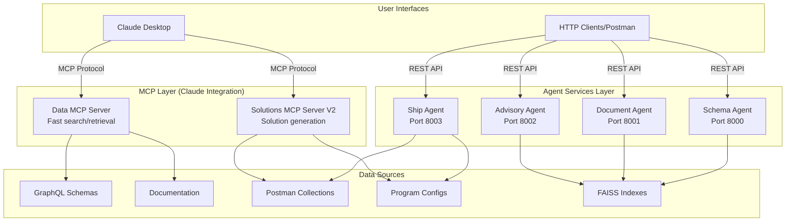

# Lamplight AI Agent - Current Architecture

## System Overview

The Lamplight AI Agent system consists of two primary subsystems that work independently:
1. **Agent Services** - HTTP-based microservices for specialized AI tasks
2. **MCP Servers** - Model Context Protocol servers for Claude Desktop integration

## Architecture Diagram



## Component Details

### 1. MCP Servers (Claude Desktop Integration)

#### Data MCP Server (`src/data_server.py`)
- **Purpose**: Fast, deterministic data retrieval for Claude
- **Features**:
  - GraphQL schema search
  - Documentation search
  - Type and operation lookup
  - Program listing
- **Performance**: Sub-second responses
- **Data Sources**: Pre-loaded JSON indexes

#### Solutions MCP Server V2 (`src/solutions_mcp_server_v2.py`)
- **Purpose**: Generate customer-facing solution documents
- **Features**:
  - Solution brief generation
  - Sequence diagram creation
  - ERD generation
  - Postman collection export
- **Source of Truth**: Postman collections
- **Auto-sync**: Optional sync from Postman on startup

### 2. Agent Services (HTTP APIs)

#### Advisory Agent (Port 8002)
- **Purpose**: Answer technical questions about implementation
- **Components**:
  - `api.py` - FastAPI endpoints
  - `agent_router.py` - Query routing logic
  - `query_classifier.py` - Intent classification
- **LLM**: Ollama with llama3.2:3b

#### Document Agent (Port 8001)
- **Purpose**: Process and search documentation
- **Components**:
  - Web scraper
  - Document chunker
  - FAISS embedder
  - LLM responder
- **Vector DB**: FAISS with sentence transformers

#### Schema Agent (Port 8000)
- **Purpose**: Analyze GraphQL schemas
- **Components**:
  - Schema parser
  - Pattern generator
  - FAISS retriever
  - LLM analyzer
- **Specialization**: GraphQL expertise

#### Ship Agent (Port 8003)
- **Purpose**: Generate implementation solutions
- **Components**:
  - Solution generator
  - Implementation planner
  - Postman integration
  - Config manager
- **Output**: Complete solution briefs

## Data Flow Patterns

### Pattern 1: Claude Desktop Query
```
Claude → MCP Server → Data Files → JSON Response → Claude
```

### Pattern 2: HTTP Client Query
```
Client → Agent API → FAISS/LLM → Generated Response → Client
```

### Pattern 3: Solution Generation
```
Request → Ship Agent → Postman/Config → LLM → Solution Document
```

## File Structure

```
lamplight-ai-agent/
├── mcp/
│   ├── src/
│   │   ├── data_server.py              # Fast data MCP
│   │   ├── solutions_mcp_server_v2.py  # Solutions MCP
│   │   └── postman_sync.py            # Sync utility
│   ├── claude_config.json              # Claude config
│   ├── launch.sh                       # Launch data server
│   └── launch_solutions.sh             # Launch solutions
│
└── agents/
    ├── advisory-agent/
    │   ├── src/
    │   │   ├── api.py
    │   │   ├── agent_router.py
    │   │   └── query_classifier.py
    │   └── launch.sh
    │
    ├── document-agent/
    │   ├── src/
    │   │   ├── api.py
    │   │   ├── web_scraper.py
    │   │   ├── doc_chunker.py
    │   │   ├── doc_embedder.py
    │   │   └── doc_llm_agent.py
    │   └── launch.sh
    │
    ├── schema-agent/
    │   ├── src/
    │   │   ├── api.py
    │   │   ├── schema_chunker.py
    │   │   ├── schema_embedder.py
    │   │   ├── schema_retriever.py
    │   │   └── schema_llm_agent.py
    │   └── launch.sh
    │
    └── ship-agent/
        ├── src/
        │   ├── api.py
        │   ├── solutions_document_generator.py
        │   └── implementation_llm_agent.py
        ├── data/
        │   ├── programs/       # YAML configs
        │   ├── operations/     # JSON operations
        │   └── postman/        # Postman collections
        └── launch.sh
```

## Integration Points

### 1. No Direct Integration
- MCP servers and agents operate independently
- No cross-communication between layers
- Each has its own data access patterns

### 2. Shared Data Sources
- Both read from same files (programs, operations, schemas)
- No shared runtime state
- File-based coordination only

### 3. User Integration
- Users can use both systems simultaneously
- Claude Desktop for MCP tools
- HTTP clients for agent APIs
- Manual coordination of results

## Running the System

### Start MCP Servers
```bash
# Terminal 1 - Data Server
cd mcp && ./launch.sh

# Terminal 2 - Solutions Server
cd mcp && ./launch_solutions.sh
```

### Start Agent Services
```bash
# Terminal 3 - Schema Agent
cd agents/schema-agent && ./launch.sh

# Terminal 4 - Document Agent  
cd agents/document-agent && ./launch.sh

# Terminal 5 - Advisory Agent
cd agents/advisory-agent && ./launch.sh

# Terminal 6 - Ship Agent
cd agents/ship-agent && ./launch.sh
```

### Test Endpoints

#### MCP (via Claude Desktop)
- Already configured in `claude_config.json`
- Tools appear automatically in Claude

#### Agents (via HTTP)
```bash
# Schema Agent
curl http://localhost:8000/query -X POST \
  -H "Content-Type: application/json" \
  -d '{"question": "What queries are available?"}'

# Document Agent
curl http://localhost:8001/search -X POST \
  -H "Content-Type: application/json" \
  -d '{"query": "authentication"}'

# Advisory Agent
curl http://localhost:8002/query -X POST \
  -H "Content-Type: application/json" \
  -d '{"question": "How to implement card issuance?"}'

# Ship Agent
curl http://localhost:8003/generate -X POST \
  -H "Content-Type: application/json" \
  -d '{"program_type": "trip_com"}'
```

## Performance Characteristics

### MCP Servers
- **Response Time**: < 100ms (no LLM)
- **Memory**: ~200MB per server
- **CPU**: Minimal (file I/O only)

### Agent Services  
- **Response Time**: 2-30s (with LLM)
- **Memory**: 1-2GB per agent
- **CPU**: High during LLM inference
- **GPU**: Optional for faster inference

## Deployment Considerations

### Development (Current)
- All services run locally
- Ollama for LLM inference
- File-based data storage
- No authentication

### Production (Future)
- Containerize each service
- Use cloud LLM APIs
- Add PostgreSQL for data
- Implement authentication
- Add monitoring/logging
- Deploy to Kubernetes

## Maintenance Notes

### Data Updates
1. **GraphQL Schemas**: Update files in schema directories
2. **Operations**: Run `postman_sync.py` after Postman changes
3. **Programs**: Edit YAML files directly
4. **Embeddings**: Regenerate with agent scripts

### Configuration
- **Ports**: Hardcoded in agent `api.py` files
- **Models**: Configured in agent code (llama3.2:3b)
- **Paths**: Relative from project root
- **Timeouts**: Configurable in server inits

## Known Limitations

1. **No inter-service communication**: Services can't call each other
2. **No shared state**: Each service maintains own data
3. **Manual coordination**: User must combine results
4. **Local only**: No remote deployment config
5. **Single instance**: No load balancing/scaling

## Future Improvements

As recommended in `ARCHITECTURE_REVIEW.md`:
1. Create unified data service layer
2. Add caching (Redis)
3. Implement service mesh
4. Add API gateway
5. Create admin dashboard
6. Add monitoring/observability

## Summary

The current architecture provides:
- ✅ Clean separation of concerns
- ✅ Independent scaling of components
- ✅ Multiple access methods (MCP/HTTP)
- ✅ Specialized agents for different tasks
- ✅ Fast data access via MCP
- ✅ Rich LLM responses via agents

Trade-offs:
- ❌ No service orchestration
- ❌ Duplicate data loading
- ❌ Manual result coordination
- ❌ Higher resource usage
- ❌ Complex deployment

This architecture works well for development and demonstration but would benefit from the unified data service layer proposed in the architecture review for production use.