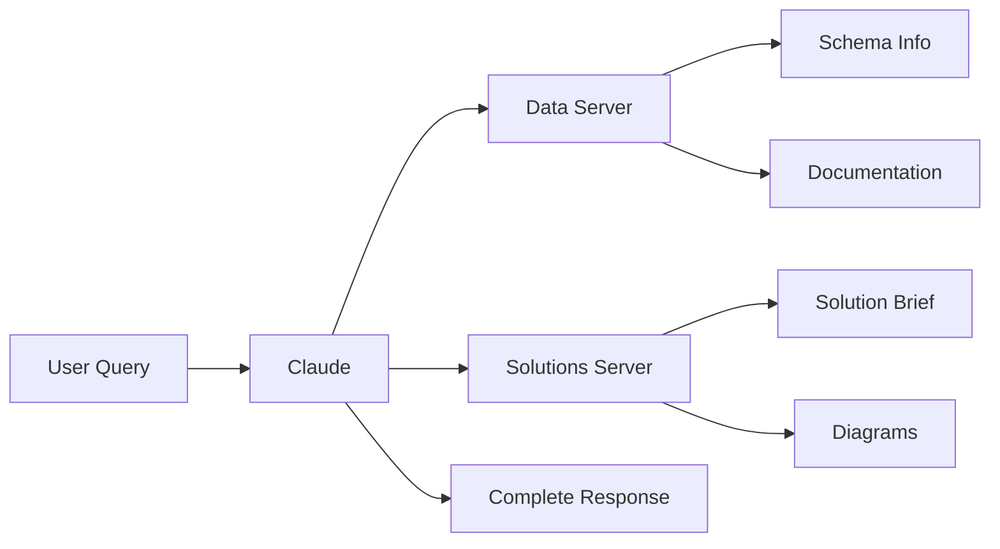

# Lamplight MCP Servers

Two specialized MCP (Model Context Protocol) servers for the Lamplight AI Agent system:
- **Data Server**: Fast, deterministic access to GraphQL schemas and documentation
- **Solutions Server**: Comprehensive solution brief generation with diagrams and workflows

## Available Servers

### 1. Data Server
Fast, deterministic access to GraphQL schemas and documentation:
- **1,795 GraphQL types** with full field information
- **320 GraphQL operations** (queries/mutations)
- **Documentation chunks** with keyword search
- **<100ms response time**

### 2. Solutions Server
Comprehensive solution generation for customer-facing briefs:
- **38 program configurations** (consumer credit, AP automation, fleet, etc.)
- **2,920 GraphQL operations** with complete templates
- **Sequence diagram generation** for workflows
- **ERD generation** for data models
- **Solution brief generation** with executive summaries
- **Postman collection** export

## Quick Start

### Install Dependencies
```bash
pip install mcp
```

### Test Installation
```bash
python test_data_server.py
```

### Launch Servers
```bash
# Data Server (fast queries)
./launch.sh

# Solutions Server (solution generation)
./launch_solutions.sh
```

### Use with Claude Desktop

1. Copy configuration:
```bash
cp claude_config.json ~/Library/Application\ Support/Claude/claude_desktop_config.json
```

2. Restart Claude Desktop

3. The servers will be available as:
   - `lamplight` - Data server for fast queries
   - `lamplight-solutions` - Solutions server for brief generation

### Use with MCP Inspector

```bash
# Data Server
npx @modelcontextprotocol/inspector python -m src.data_server

# Solutions Server
npx @modelcontextprotocol/inspector python -m src.solutions_mcp_server
```

## Performance Comparison

| Server | Response Time | Use Case | Data Volume |
|--------|--------------|----------|-------------|
| **Data Server** | <100ms | Fast queries, real-time search | 1,795 types, 100 docs |
| **Solutions Server** | <500ms | Solution generation, diagrams | 38 programs, 2,920 operations |

## Architecture

```
mcp/
├── src/
│   ├── data_server.py          # Fast data access server
│   └── solutions_mcp_server.py # Solution generation server
├── claude_config.json          # Claude Desktop configuration
├── launch.sh                   # Launch data server
├── launch_solutions.sh         # Launch solutions server
├── test_data_server.py         # Test data server
└── test_solutions_server.py    # Test solutions server
```

## Available Tools

### Data Server Tools
- `search_schema_types` - Search GraphQL types
- `get_type_details` - Get type information  
- `search_operations` - Find queries/mutations
- `search_documentation` - Search docs
- `get_statistics` - Get data statistics

### Solutions Server Tools
- `list_programs` - List all 38 available programs
- `get_program_info` - Get complete program configuration
- `find_operations` - Search 2,920 GraphQL operations
- `get_operation_details` - Get full operation with GraphQL
- `generate_sequence_diagram` - Create workflow diagrams
- `generate_erd` - Create entity relationship diagrams
- `generate_solution_brief` - Generate customer-facing brief
- `get_postman_collection` - Export Postman collections


## Troubleshooting

### No data returned
- Verify GraphQL schema exists in `/agents/schema-agent/schema/`
- Check documentation chunks in `/agents/document-agent/data/chunks/`

### Import errors
- Ensure you're in the `/mcp` directory
- Install requirements: `pip install mcp`

## Use Cases

### When to Use Data Server
- Real-time schema lookups
- Documentation search
- Quick type/field information
- Fast, deterministic responses needed

### When to Use Solutions Server  
- Generating customer-facing solution briefs
- Creating architecture diagrams
- Building Postman collections
- Comprehensive implementation guides
- Program-specific workflows

## Example Workflow



## Support

For issues or questions:
- Check server logs for detailed error messages
- Test with `test_data_server.py` or `test_solutions_server.py`
- Use MCP Inspector for interactive debugging